# Memory Engine

Local-first “room memory” appliance: record a short sound offering, choose consent, receive a revoke code, and let the room replay contributions with **very light decay per access**. Nodes are offline/local-first by design.

This repo now opens one layer wider: **Memory Engine is still the canonical center and default deployment**. The current runtime, routes, and operator flow stay intact while the config and docs now name a small set of secondary deployment temperaments (`question`, `prompt`, `repair`, `witness`, `oracle`) that can be realized mostly through copy, metadata framing, and playback policy. This is an expansion, not a rebrand, and the shared architectural substrate remains internal language rather than the public face of the project.

## Documentation Site

The repo now includes an MkDocs manual so the machine has a real front door instead of asking operators and maintainers to navigate raw repo structure first.

- docs landing page: [docs/index.md](docs/index.md)
- role-based orientation: [docs/start-here.md](docs/start-here.md)
- shortest system map: [docs/AT_A_GLANCE.md](docs/AT_A_GLANCE.md)
- naming and deployment-status policy: [docs/NAMING.md](docs/NAMING.md)

Serve the docs locally:

```bash
python3 -m venv .venv
./.venv/bin/pip install -r docs/requirements.txt
./.venv/bin/mkdocs serve
```

Build the static docs site:

```bash
./.venv/bin/mkdocs build
```

## Start Here

If you need the shortest possible orientation:

- docs front door and role-based manual: [docs/index.md](docs/index.md), [docs/start-here.md](docs/start-here.md)
- first-glance system map and "which knob matters where": [docs/AT_A_GLANCE.md](docs/AT_A_GLANCE.md)
- deploy, backup, restore, and troubleshooting commands: [docs/maintenance.md](docs/maintenance.md)
- reference Ubuntu host recipe for firewall and restart-on-boot posture: [docs/UBUNTU_APPLIANCE.md](docs/UBUNTU_APPLIANCE.md)
- ninety-second non-author recovery ritual: [docs/OPERATOR_DRILL_CARD.md](docs/OPERATOR_DRILL_CARD.md)
- full architecture and request/data flow: [docs/how-the-stack-works.md](docs/how-the-stack-works.md)
- deployment temperament and playback differences: [docs/DEPLOYMENT_BEHAVIORS.md](docs/DEPLOYMENT_BEHAVIORS.md)

## What you get
- Django + DRF API (Artifacts, Pool playback, Revocation, Node status)
- Postgres for metadata
- MinIO for blob storage (raw audio + spectrogram / essence fossils)
- Redis + Celery (+ Beat) for background jobs (derivative generation + expiry)
- Separate client surfaces: `/kiosk/` for recording and `/room/` for dedicated playback
- “Don’t save” = **play once immediately, then discard**
- A participant can now choose a first-pass memory color (`Clear`, `Warm`, `Radio`, `Dream`) during review; the dry WAV stays unchanged in storage and the color choice is stored separately on the artifact for playback
- Those memory-color profiles now come from one shared catalog used by Django, the kiosk review UI, and `/ops/`, so the profile list and first-pass tuning stay aligned across storage, playback, and operator visibility. Audio behavior stays bounded through a small topology dispatch layer rather than arbitrary DSP graphs, so a new profile can often be added by editing the catalog if it reuses an existing topology. `Dream` is seeded from the source audio so preview and later playback stay materially aligned.


## Deployment family (explicit in this pass)

Memory Engine is still the default and production-safe baseline.

This pass makes six deployment kinds explicit and runnable through one shared local-first artifact engine:

- `memory` (default)
- `question`
- `prompt`
- `repair`
- `witness`
- `oracle`

Set deployment kind with:

```env
ENGINE_DEPLOYMENT=memory
```

If unset, startup defaults to `memory`. If set to an unknown value, startup fails fast during config validation so operators see the mistake immediately.

Practical intent: same routes and steward posture, different intake framing, copy, metadata expectations, and playback weighting.

Current documentation posture:

- `memory` is the stable home deployment
- `question` and `repair` are the most developed secondary deployments
- `prompt`, `witness`, and `oracle` remain more experimental and should be described that way

## Quick start
1) Install Docker + Docker Compose.
2) Copy env:
```bash
cp .env.example .env
```
3) Build + run:
```bash
docker compose up --build
```
4) Open:
- Kiosk: http://localhost/kiosk/
- Room playback: http://localhost/room/
- Admin: http://localhost/admin/  (creates a default superuser in dev; see logs)
- Ops: http://localhost/ops/

`/ops/` now requires the shared steward secret from `OPS_SHARED_SECRET`, and it
can also be restricted to trusted networks with `OPS_ALLOWED_NETWORKS`.

For a real multi-machine install, the intended role split is:
- recording machine opens `/kiosk/`
- playback machine opens `/room/`
- steward/operator machine opens `/ops/`

### Surface snapshots

Recording kiosk idle:

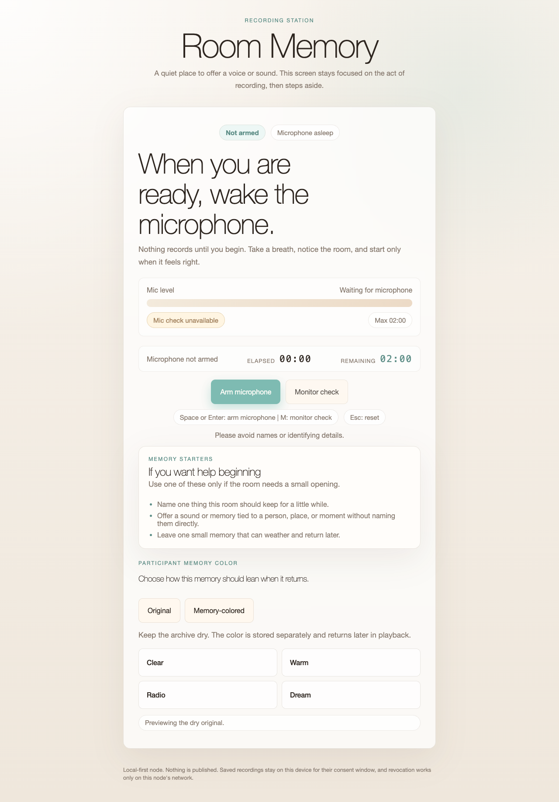

Listening surface:

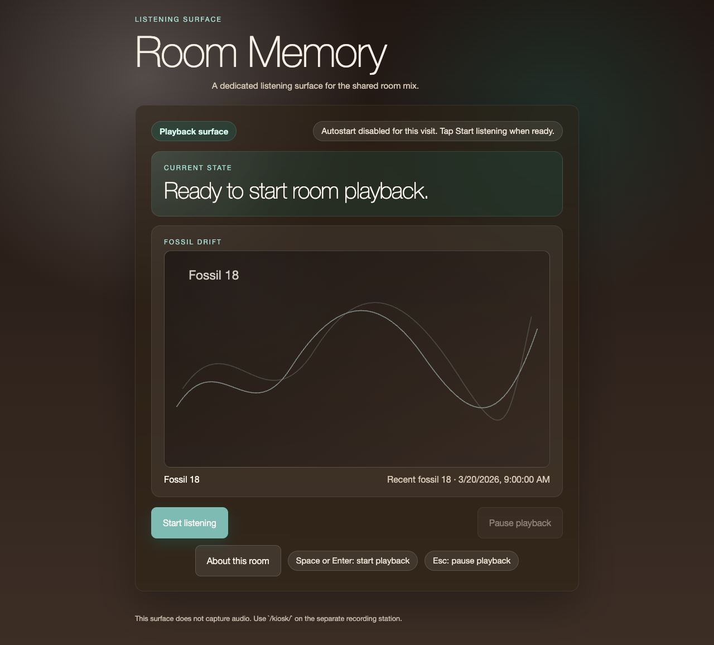

Operator dashboard:

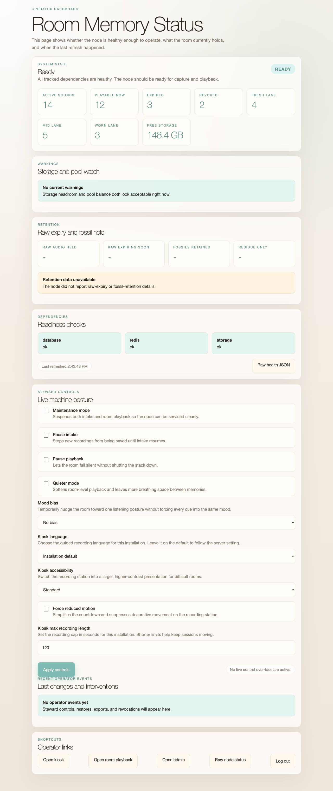

## Supported Runtime

The official supported runtime for this repo is:

- Docker Compose for the full stack
- the `api` container defined by `api/Dockerfile`, which is pinned to Python `3.12`

That is the path the deployment scripts, compose stack, and production posture
are designed around.

Local `.venv` use is still supported as a maintenance and CI convenience path,
but it is best-effort rather than the primary contract. Browser tooling,
scientific dependencies, and host Python packaging may behave differently
outside the container lane.

Practical rule:

- if you want the canonical runtime, use `docker compose up --build`
- if you want the canonical repo gate, run `./scripts/check.sh`
- if local host Python differs from `3.12`, treat it as a convenience path, not the source of truth

`./scripts/check.sh` now also writes coverage artifacts under
`test-results/coverage/`, including Python JSON/XML/HTML reports and Node V8
coverage output for the frontend unit-test lane. It also runs a small default
Playwright subset against real `/kiosk/`, `/room/`, `/ops/`, and `/revoke/`
surfaces; the heavier compose-backed release smoke remains separate.

## Server deployment: public IP now, domain later
The compose stack is set up for a reverse proxy in front of Django:
- `caddy` is the public entrypoint on `80/443`
- Django runs behind it via `gunicorn`
- static files are served through Django/WhiteNoise
- MinIO is no longer exposed publicly by default
- MinIO server and `mc` helper images are now pinned to fixed release tags by default instead of `latest`
- `/healthz` exposes narrow API/dependency health for container health checks
- `/readyz` exposes broader cluster readiness, including worker/beat heartbeat state

The fastest path on a fresh server is the deploy script:

```bash
./scripts/first_boot.sh --public-host 203.0.113.10 --deploy
```

If you prefer to separate secret generation from deployment:

```bash
./scripts/first_boot.sh --public-host 203.0.113.10
./scripts/deploy.sh --public-host 203.0.113.10
```

If the kiosk device needs recording before DNS exists and you control that device's trust store, use:

```bash
./scripts/deploy.sh --public-host 203.0.113.10 --tls internal
```

Later, when DNS exists:

```bash
./scripts/deploy.sh --public-host memory.example.com
```

What the script does:
- creates `.env` from `.env.example` if needed
- writes the public host, Caddy site address, Django allowed hosts, and CSRF trusted origins
- generates a fresh `OPS_SHARED_SECRET` if the default placeholder is still present
- turns off Django debug mode and dev superuser bootstrap
- refuses to deploy if obvious dev secrets are still unchanged
- runs `docker compose up --build -d`

For stronger steward posture on a real server, also set:

```env
OPS_ALLOWED_NETWORKS=127.0.0.1/32,10.0.0.0/8
OPS_SESSION_BINDING_MODE=user_agent
OPS_LOGIN_MAX_ATTEMPTS=6
OPS_LOGIN_LOCKOUT_SECONDS=900
```

That adds a trusted-network allowlist and temporary lockout after repeated bad
secret guesses. Operator sessions are browser-bound by default, without forcing
the operator IP to stay fixed across the session. If you want the older stricter
posture, set `OPS_SESSION_BINDING_MODE=strict`. For a trusted single-site
install where proxy/IP churn is more annoying than helpful, `none` is also
available.

`/healthz` stays intentionally narrow: database, Redis reachability, and MinIO.
`/readyz` and `/ops/` carry the broader cluster view, including Celery worker
and beat heartbeats, so a node can show degraded if Redis is reachable but
scheduled maintenance or derivative work is no longer advancing.

If the app sits behind a reverse proxy and you want throttling / operator
allowlisting to trust `X-Forwarded-For`, also set:

```env
DJANGO_TRUST_X_FORWARDED_FOR=1
```

Leave that off unless your proxy strips inbound forwarded headers and rewrites
them itself.

For shared cache-backed operator and throttle state, Django uses `CACHE_URL`
when set and otherwise falls back to `REDIS_URL`. Outside debug mode, the app
now fails fast if neither is present unless you explicitly opt into
`DJANGO_ALLOW_LOCAL_MEMORY_CACHE=1` for an isolated local harness.

Operator lockout now defaults to `OPS_LOGIN_LOCKOUT_SCOPE=ip_user_agent`, so a
mistyped secret from one steward browser is less likely to lock out every
operator behind the same NAT. Use `ip` only if you explicitly want the coarser
shared-network lockout posture.

For a server that is already bootstrapped and just needs the usual
`pull -> test -> backup -> deploy -> status` cycle, use:

```bash
./scripts/update.sh --public-host memory.example.com
```

That wrapper will:
- fast-forward pull the current branch from `origin`
- run `./scripts/check.sh`
- run `./scripts/doctor.sh`
- create a backup
- deploy the stack
- print final status and readiness

For dedicated client machines, the repo now also includes a Chromium launcher
helper:

```bash
./scripts/browser_kiosk.sh --role kiosk --base-url https://memory.example.com
./scripts/browser_kiosk.sh --role room --base-url https://memory.example.com
```

The `/room/` launch path automatically adds autoplay-hardening flags so the
listening surface is less likely to wake up visually alive but mute after boot.

Useful flags:

```bash
./scripts/update.sh --public-host memory.example.com --skip-pull
./scripts/update.sh --public-host 203.0.113.10 --tls internal
./scripts/update.sh --public-host memory.example.com --branch main
```

Backup and restore helpers are included for operators:

```bash
./scripts/backup.sh
./scripts/restore.sh --from backups/20260317-120000
./scripts/export_bundle.sh --latest
./scripts/support_bundle.sh
```

Fast maintenance helpers are also included:

```bash
./scripts/check.sh
./scripts/status.sh
./scripts/doctor.sh
```

GitHub Actions runs that same `./scripts/check.sh` gate from a repo-local
`.venv`, so CI matches the local maintenance path instead of using a different
test command.

`./scripts/check.sh` now prints which Python it is using so it is obvious when
you are on the official `3.12` lane versus a local convenience interpreter.

At process startup, Django now also validates the runtime config shape beyond
secret presence: threshold ordering, secure-origin posture, MinIO endpoint
scheme, and other range relationships fail fast instead of surfacing later as
ambiguous runtime behavior.

Public ingest is also hardened server-side now: the API enforces a maximum WAV
upload size, a maximum recording duration, PCM 16-bit mono WAV validation, and
public throttling on ingest and revoke endpoints instead of trusting the
browser's reported duration alone. `/ops/` now exposes both the configured
budgets and recent throttle hits so a busy installation can see the ceiling
before it feels arbitrary, and `/kiosk/` now gives a soft warning when the
current station is approaching its remaining ingest budget.

For common installs, you can also start from a named behavior preset:

```env
INSTALLATION_PROFILE=shared_lab
```

And you can declare the active deployment kind (default stays `memory`):

```env
ENGINE_DEPLOYMENT=memory
```

Planned deployment kinds: `memory`, `question`, `prompt`, `repair`, `witness`, `oracle`.

Available profiles:
- `custom`: no bundled behavior overrides
- `quiet_gallery`: quieter pacing and softer overnight posture
- `shared_lab`: balanced defaults for a multi-surface lab or classroom
- `active_exhibit`: quicker pacing and stronger layering for busier public use

Explicit env vars still win over the profile, so the profile is a starting
point rather than a lock-in.

For browser-level simulation and screenshots, the repo also supports a small
Playwright layer:

```bash
npm install
npx playwright install chromium
npm run screenshots
```

That starts Django with the browser test settings, opens the recording kiosk,
the dedicated playback surface, and the operator dashboard in headless
Chromium, and writes fresh generated screenshots under `artifacts/screenshots/`.
The curated screenshots embedded in this README live in `docs/screenshots/`.
The browser walkthrough now also signs into `/ops/`, applies live steward
controls, and captures how `/kiosk/` and `/room/` react to those changes.

More captured states:

- Accessible recording mode: 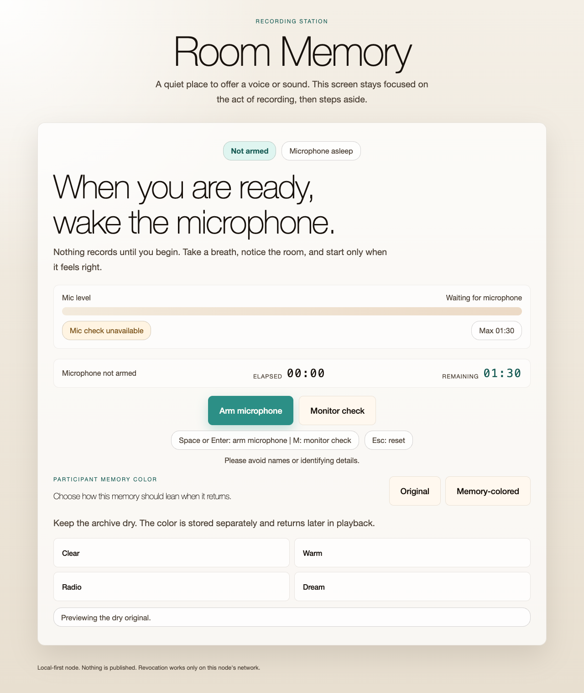
- Spanish recording mode: 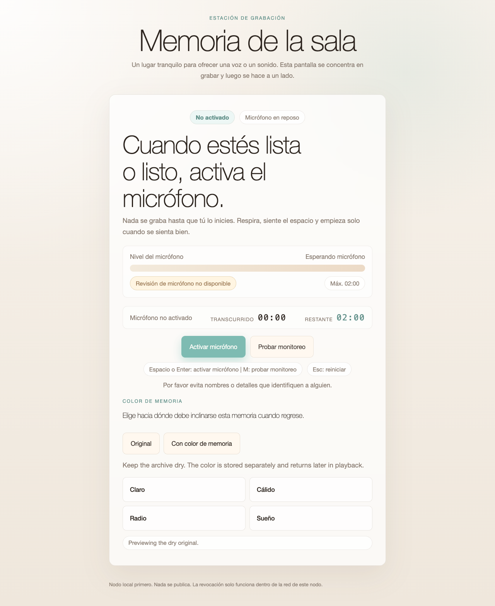
- Intake paused at the recorder: 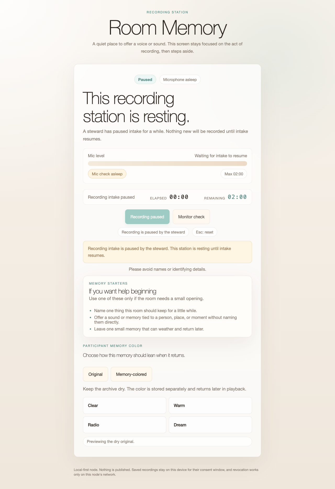
- Playback info lightbox: 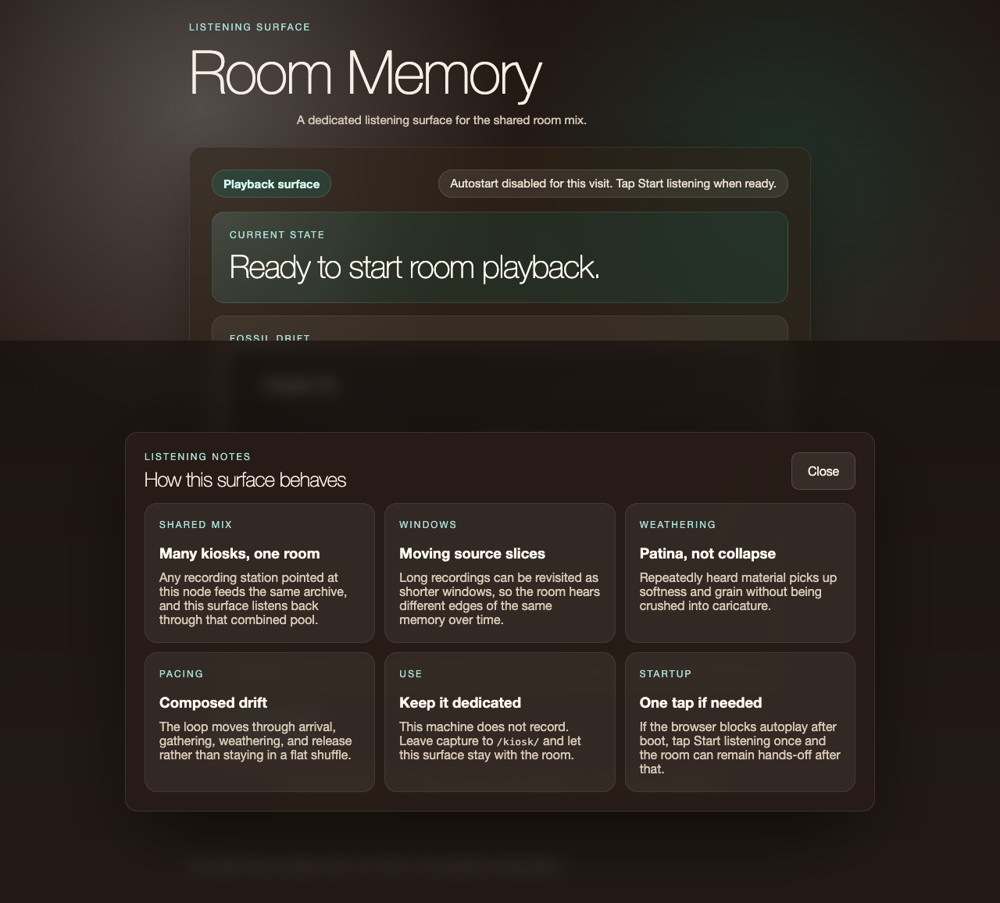
- Quieter listening mode: 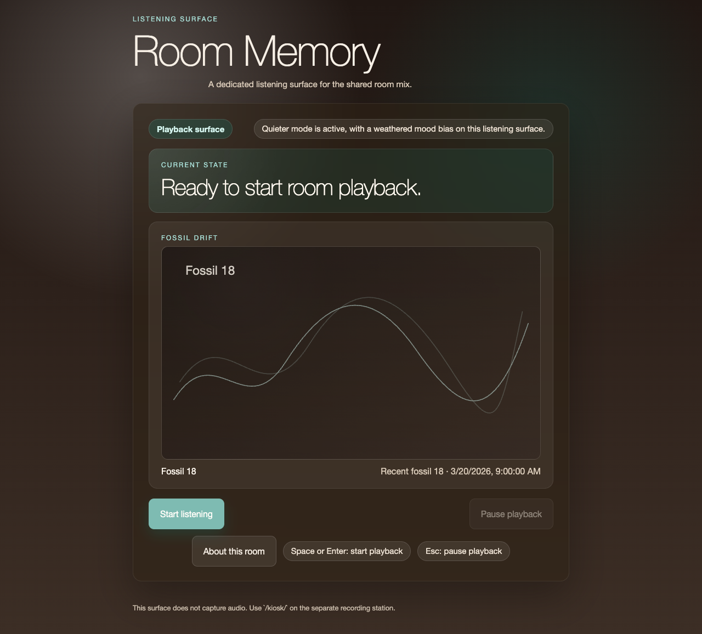
- Live operator controls: 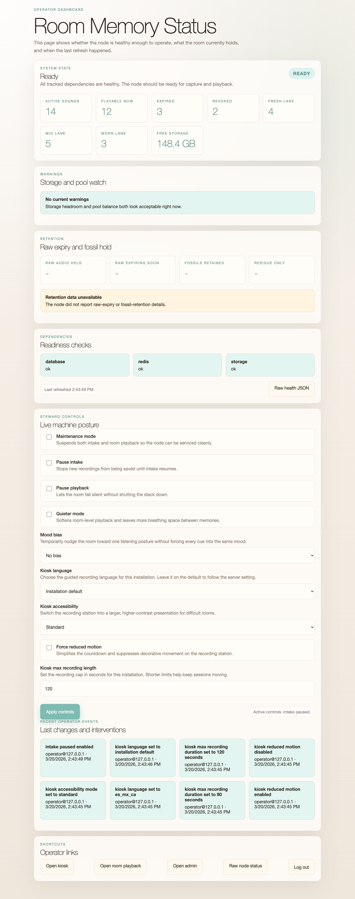
- Operator stewardship and emergency controls: 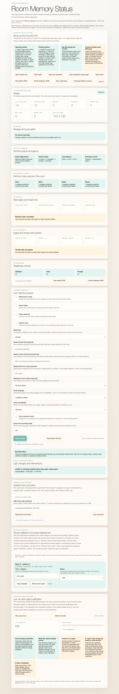
- Degraded operator state: 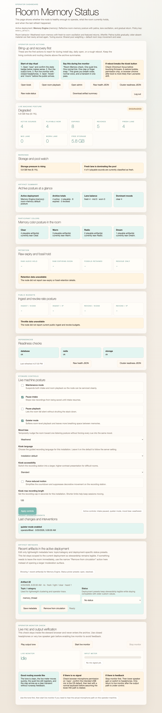

Longer operator notes live in `docs/maintenance.md`.
That includes a MinIO section covering which credentials live where, what is set before first deploy, and how manual MinIO provisioning changes the `.env` values.
The install-day hardware and kiosk checklist lives in `docs/installation-checklist.md`.
The explicit recorder/playback/operator role split lives in `docs/multi-machine-setup.md`.
The printable off-screen participant guidance lives in `docs/participant-prompt-card.md`.
The architecture and request-flow notes live in `docs/how-the-stack-works.md`.
The shortest browser/API boundary notes live in `docs/surface-contract.md`.

For a server reachable at `203.0.113.10`, set these values in `.env`:

```env
DJANGO_DEBUG=0
DJANGO_SECRET_KEY=replace-this
DJANGO_ALLOWED_HOSTS=203.0.113.10,localhost,127.0.0.1
DJANGO_CSRF_TRUSTED_ORIGINS=http://203.0.113.10,http://localhost,http://127.0.0.1
DEV_CREATE_SUPERUSER=0

APP_SITE_ADDRESS=:80
APP_TLS_DIRECTIVE=
```

Then bring the stack up:

```bash
docker compose up --build -d
```

At that point the site will be available at:
- `http://203.0.113.10/kiosk/`

Important browser constraint:
- the recording UI uses `getUserMedia`, so remote microphone capture usually needs `https://...` or `localhost`
- plain `http://203.0.113.10/...` is fine for viewing the site, but many browsers will block microphone recording there

If you need recording before DNS exists, the practical dedicated-kiosk workaround is:
```env
APP_SITE_ADDRESS=203.0.113.10
APP_TLS_DIRECTIVE=tls internal
DJANGO_ALLOWED_HOSTS=203.0.113.10,localhost,127.0.0.1
DJANGO_CSRF_TRUSTED_ORIGINS=https://203.0.113.10,http://localhost,http://127.0.0.1
DJANGO_SECURE_SSL_REDIRECT=1
DJANGO_SESSION_COOKIE_SECURE=1
DJANGO_CSRF_COOKIE_SECURE=1
```

That makes Caddy serve HTTPS with its own internal CA. This only works cleanly if you control the kiosk device and trust Caddy's root certificate there. It is not appropriate for general public browsers.

When the real domain exists later, switch to:

```env
APP_SITE_ADDRESS=memory.example.com
APP_TLS_DIRECTIVE=
DJANGO_ALLOWED_HOSTS=memory.example.com,203.0.113.10,localhost,127.0.0.1
DJANGO_CSRF_TRUSTED_ORIGINS=https://memory.example.com,http://localhost,http://127.0.0.1
DJANGO_SECURE_SSL_REDIRECT=1
DJANGO_SESSION_COOKIE_SECURE=1
DJANGO_CSRF_COOKIE_SECURE=1
```

Caddy will then be able to obtain a public certificate automatically, assuming ports `80` and `443` are open to the server.

## Notes

## Guided kiosk flow
- The kiosk UI now uses an explicit guided flow: `not armed` -> `armed` -> `recording` -> `review` -> `done`.
- The microphone stays asleep until the participant arms it, which makes the start of the interaction clearer and less intrusive.
- A short visual pre-roll countdown and a soft cue tone give the speaker a moment to settle before capture begins.
- The live meter now doubles as an explicit mic check, and recording shows both elapsed and remaining time with an auto-stop cap.
- Keyboard support is built in for kiosk deployments:
  - `Space` or `Enter` advances the primary action for the current state
  - `1`, `2`, `3` choose the memory mode after recording
- `M` opens or closes a built-in monitor check
- `Esc` resets the session, or cancels the current take while recording
- A first hands-free hardware path now exists through an Arduino Leonardo acting as a USB keyboard button. See [docs/HANDS_FREE_CONTROLS.md](./docs/HANDS_FREE_CONTROLS.md).
- `/kiosk/` now also includes a small monitor-check state so stewards can verify speakers, headphones, or monitor output before inviting the next person to record.
- Saved-take receipts now also explain, in participant-facing language, how to ask a steward on this node to revoke a recording later using the receipt code.
- Recorded takes now get light silence trimming, peak normalization, and short fades before upload.

## Raspberry Pi / Piper kit posture
- This frontend is still intentionally light: plain Django templates, plain CSS, and a single browser script. No front-end build step is required.
- The intended deployment is a Raspberry Pi 3 class device running the site in Chromium kiosk mode with a USB microphone attached.
- The guided prompts and large controls are designed to work with touch, mouse, or a simple keyboard, which fits a Piper kit enclosure better than precise small controls.
- That same keyboard posture now also makes a Leonardo-based single-button trigger viable without any host-side bridge process.
- The live mic meter is meant to give immediate confidence that the USB microphone is actually receiving sound before recording starts.

## Playback feel
- The room loop now uses a cooldown-aware weighted selection instead of always taking the first eligible artifact.
- Selection now also leans on age and recentness, so brand-new material does not dominate immediately and long-circulating material does not calcify into a fixed archive.
- Playback now alternates between fresher and more worn memories when possible, so the room has a stronger sense of temporal depth.
- A subtle room-tone bed rises when the pool is sparse and ducks under spoken material, which keeps silence from feeling like a broken system.
- The browser loop now composes short scenes instead of only picking one item at a time: it clusters related densities and moods, inserts occasional longer holds, and lets fresh/mid/worn material gather into phrases.
- The loop now moves through longer-form movements such as arrival, gathering, weathering, and release, so pacing can shift across a wider span instead of only reacting clip-to-clip.
- Playback applies loudness smoothing, gentle fades, and a small gap between loop items so the room feels less abrupt and less repetitive.

## Audience experience notes
- The playback system is trying to feel composed rather than merely shuffled. It asks for kinds of memories, not exact files, and then lets weighted randomness keep the room alive.
- `fresh`, `mid`, and `worn` are not just technical labels. They are the main temporal language of the room: newer offerings feel nearer, older and repeatedly heard offerings feel more weathered.
- Intentional pauses are part of the piece. Some moments hold only the room-tone bed on purpose so the space can breathe between voices.
- Wear is meant to read as patina, not collapse. As memories are replayed, they lose a little brightness, pick up a little grain, and settle further into the room without turning into a gimmicky lo-fi effect.
- Loudness is gently normalized so a quiet speaker and a loud speaker can coexist in the same installation without the room feeling jumpy or broken.
- The scene logic reacts to recent playback so the system can counterbalance itself: too much worn material opens toward fresher space, and dense clusters are often followed by more suspended moments.
- A longer movement cycle sits above that local counterbalance. The room can spend a few memories gathering energy, drift into weathered material, and then open back out rather than staying in one perpetual middle state.

## Operator view
- `/ops/` now sits behind the shared steward secret in `OPS_SHARED_SECRET`, with optional trusted-network enforcement from `OPS_ALLOWED_NETWORKS`.
- After sign-in, `/ops/` provides the node state (`ready`, `degraded`, `broken`), dependency checks, current artifact counts, and a quick view of fresh/mid/worn lane balance.
- `/ops/` also carries live steward controls for maintenance mode, pausing intake, pausing playback, and switching the room into a quieter mode.
- `/ops/` now includes a retention view for raw-audio expiry pressure and fossil hold posture.
- `/ops/` recent events now include revocations, restores, exports, and live control changes.

## Decay feel tuning (v0)
The kiosk applies **stateful wear** on each playback (raw audio remains immutable). Wear is stored server-side and mapped to gentle “memory loss” effects client-side (WebAudio).

Recommended starting values:
- `WEAR_EPSILON_PER_PLAY=0.003` (about 300 plays to reach full patina)
- Lowpass gradually reduces “air” (but never collapses to a telephone filter)
- Bit reduction stays subtle (16→12 bits) + slight sample-hold grain
- Noise floor rises very slightly (like tape hiss), no harsh dropouts

If you want faster/stronger change, raise epsilon to `0.005–0.01`.

- This is a **skeleton**: the policies are minimal but the architecture is ready to evolve.
- Blob access is proxied through Django, so the kiosk can fetch audio without MinIO CORS config.
- The decay is “stateful wear”: raw audio is immutable; wear accumulates and is applied during playback.

## Directory map
- `docker-compose.yml` — full local node stack
- `docs/maintenance.md` — deployment, status, backup, restore, and troubleshooting runbook
- `docs/UBUNTU_APPLIANCE.md` — reference `Ubuntu Server 24.04.4 LTS` host recipe
- `docs/how-the-stack-works.md` — architecture, request flows, playback model, storage, and testing notes
- `docs/installation-checklist.md` — hardware, browser kiosk mode, audio, and auto-start install checklist
- `docs/roadmap.md` — landed changes and the next likely improvements
- `scripts/check.sh` — browser syntax, frontend smoke tests, Django behavior tests, and patch-hygiene validation
- `scripts/release_smoke.sh` — disposable compose-backed ritual test for kiosk submit, room playback, and ops visibility on localhost `:18080`
- `scripts/clean_local.sh` — clear regenerable local caches such as `api/.test-cache`, `__pycache__`, and Playwright output
- `scripts/doctor.sh` — operator-focused env, compose, `/healthz`, `/readyz`, storage, and browser-constraint checks
- `scripts/browser_kiosk.sh` — Chromium kiosk launcher for `/kiosk/`, `/room/`, or `/ops/`, with autoplay-safe flags for the listening surface
- `scripts/deploy.sh` — server-side deploy helper for IP-now / domain-later rollout
- `scripts/update.sh` — server-side pull, verify, backup, deploy, and status helper for existing installs
- `scripts/first_boot.sh` — bootstrap strong secrets and node identity before deployment
- `scripts/backup.sh` — snapshot Postgres + MinIO data
- `scripts/restore.sh` — restore Postgres + MinIO data from a backup folder
- `scripts/export_bundle.sh` — package one backup snapshot into a portable handoff archive with checksums
- `scripts/support_bundle.sh` — gather redacted env, `/healthz`, `/readyz`, status, recent logs, and an artifact summary for remote support
- `/api/v1/operator/artifact-summary` — operator-only JSON download of current artifact posture, including lane, mood, retention, and memory-color counts
- `scripts/status.sh` — compose, `/healthz`, and `/readyz` summary for operators
- `api/` — Django project + Celery worker
- `api/engine/` — models, API endpoints, tasks
- `api/engine/templates/engine/kiosk.html` — kiosk UI
- `api/engine/static/engine/kiosk.js` — recording/playback + light decay

For the closest thing in the repo to a full appliance release proof, run:

```bash
./scripts/release_smoke.sh
```

That boots a disposable compose project, waits for `/healthz` and `/readyz`,
then runs a live browser flow that submits a memory-colored `ROOM` artifact and
confirms room and ops alignment.

## Next obvious extensions
- Node-as-AP mode scripts (captive portal) for true “room Wi‑Fi”
- Policy editor UI (Decay Policy DSL)
- Export bundles (fossils + anonymized stats) to USB
- Federation (fossil-only sync between nodes)


## Mission expansion notes
- `docs/MISSION_EXPANSION.md` — first-pass framing for Memory Engine + sibling deployments on one local-first artifact engine.
- `docs/DEPLOYMENT_BEHAVIORS.md` — playback/afterlife behavior by deployment.
- `docs/RESPONSIVENESS.md` — feedback ladder (immediate, near-immediate, ambient afterlife).
