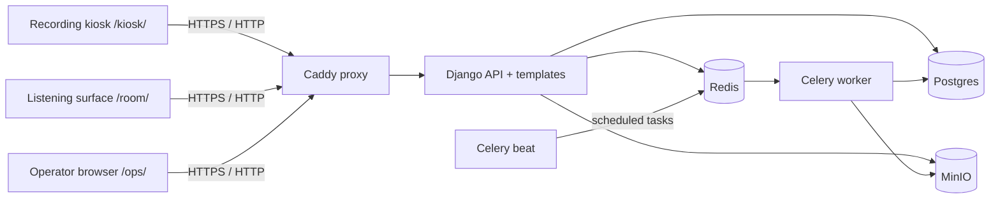
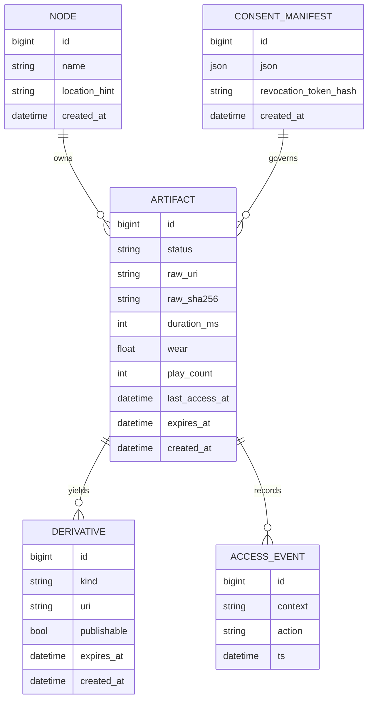
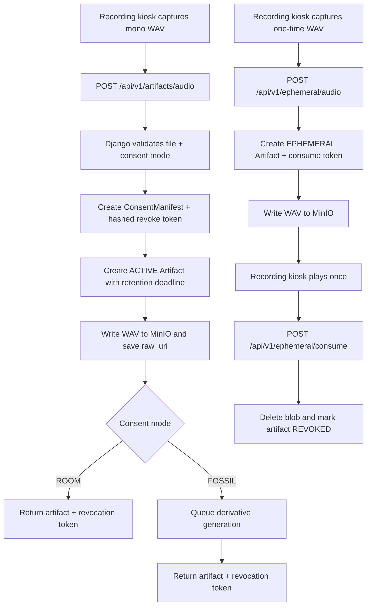
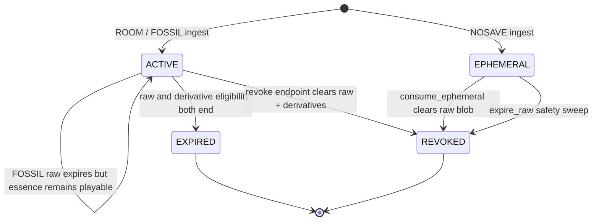

# How The Stack Works

This document is the "how" companion to the runbook. It explains what the
machine is made of, which process owns which responsibility, and how a
participant's recording moves through the stack from browser capture to room
playback, expiry, revocation, and operator visibility.

If you only need deploy and repair steps, use `docs/maintenance.md`. This file
is for understanding the architecture well enough to modify it safely.

If you need explicit client-role instructions for a real install, use
`docs/multi-machine-setup.md` alongside this file.

If you need the shortest explicit browser/API boundary notes, use
`docs/surface-contract.md`.

## Design posture

The stack is intentionally local-first and appliance-shaped.

- A recording kiosk captures audio, while a separate playback surface can run
  the room loop.
- Django stores metadata in Postgres and object bytes in MinIO.
- Celery workers generate long-lived derivatives and run retention cleanup.
- The room loop is composed in the browser, but it asks the server for one
  eligible artifact at a time.
- Blob access is proxied through Django, so the browser never needs direct
  MinIO credentials or CORS access.

That split matters:

- browser code owns interaction feel, capture flow, and playback texture
- Django owns policy, retention, consent, access control, and playback
  eligibility
- Postgres is the source of truth for artifact state
- MinIO is the source of truth for stored bytes
- Redis is only transport for Celery

## Runtime topology

The deployed compose stack in `docker-compose.yml` has seven practical runtime
services:

1. `proxy`
   Caddy is the public entrypoint on ports `80/443`. It terminates TLS and
   forwards HTTP traffic to Django.
2. `api`
   The Django app serves `/kiosk/`, `/ops/`, `/healthz`, and the JSON API under
   `/api/v1/`.
3. `db`
   Postgres stores node metadata, consent manifests, artifacts, derivatives,
   and access events.
4. `redis`
   Celery broker/result backend.
5. `worker`
   Celery worker for spectrogram generation and cleanup tasks.
6. `beat`
   Celery Beat scheduler for periodic expiry and derivative pruning.
7. `minio`
   Private S3-compatible object storage for raw WAV files and derivative images.

There is also a one-shot `minio_init` helper that ensures the configured bucket
exists before the app starts using it.

In request terms, the paths are:

- `recording kiosk -> Caddy -> Django -> Postgres/MinIO`
- `playback surface -> Caddy -> Django -> Postgres/MinIO`
- `operator browser -> Caddy -> Django -> Postgres/MinIO`

In background-job terms, the path is:

`Django -> Redis -> Celery worker -> MinIO/Postgres`

The shape looks like this in practice:



## URL surface

The root URL table lives in `api/memory_engine/urls.py`.

- `/kiosk/` renders the recording station
- `/room/` renders the dedicated playback surface
- `/ops/` renders the operator dashboard and sign-in surface
- `/healthz` reports dependency readiness
- `/api/v1/...` exposes the kiosk and ops API surface

In the intended field setup:

- the recording machine opens `/kiosk/`
- the playback machine opens `/room/`
- the operator machine opens `/ops/` and signs in with `OPS_SHARED_SECRET`

The app API routes in `api/engine/urls.py` break down into five groups:

- ingest
  `/api/v1/artifacts/audio`
  `/api/v1/ephemeral/audio`
- one-time ephemeral disposal
  `/api/v1/ephemeral/consume`
- consent revocation
  `/api/v1/revoke`
- playback and observation
  `/api/v1/pool/next`
  `/api/v1/surface/state`
  `/api/v1/node/status`
  `/api/v1/healthz`
  `/api/v1/operator/controls`
- blob and derivative access
  `/api/v1/blob/<id>/raw`
  `/api/v1/derivatives/spectrograms`

## Data model

The core models live in `api/engine/models.py`.

### `Node`

Represents one physical installation or appliance. In practice the repo
currently assumes a single active node per database, and lazily creates the
first `Node` row from environment variables if none exists yet.

### `ConsentManifest`

Stores the exact consent/retention policy applied when a take was submitted.
The important detail here is that consent is persisted as JSON, not inferred
later from UI labels. That means retention and derivative behavior are tied to
the original submission policy, not to whatever the UI might say in the future.

It also stores a hash of the revocation token rather than the token itself.

### `Artifact`

This is the main unit of stored sound.

Important fields:

- `status`
  `ACTIVE`, `EXPIRED`, `REVOKED`, or `EPHEMERAL`
- `raw_uri`
  object-storage key for the WAV file
- `duration_ms`
  used both for UI reporting and playback density heuristics
- `wear`
  accumulated playback patina from `0.0` to `1.0`
- `play_count`
  how often the artifact has been selected by the room loop
- `last_access_at`
  recent-play cooldown signal
- `expires_at`
  when raw storage should no longer remain eligible

### `Derivative`

Currently used for two fossil-side derivative types:

- `spectrogram_png`
- `essence_wav`

The important policy distinction is that derivatives can outlive raw audio when
the consent mode allows that.

### `AccessEvent`

Records each playback action. Right now the primary use is a lightweight audit
trail and debugging signal around pool behavior.

### `StewardState`

Stores the current live operator posture for the whole node:

- whether intake is paused
- whether playback is paused
- whether quieter mode is active

This is a singleton-style row rather than per-browser state, because the room
needs all client machines to agree on the same current stewardship posture.

### `StewardAction`

Records each live operator control change with a timestamp, actor label, and a
small JSON payload describing the change.

The core data shape is:



## Consent and retention modes

The consent policy builder lives in `api/engine/consent.py`.

There are three practical modes:

### `ROOM`

- raw audio stored locally
- no publishable derivative generated
- raw expires after `RAW_TTL_HOURS_ROOM`
- revocation is allowed

### `FOSSIL`

- raw audio stored locally
- spectrogram and low-storage audio-residue derivatives are allowed
- raw expires after `RAW_TTL_HOURS_FOSSIL`
- derivative expires after `DERIVATIVE_TTL_DAYS_FOSSIL`
- revocation is allowed

### `NOSAVE`

- raw audio is created only for immediate one-time playback
- no long-lived derivative is generated
- revocation is not offered because the take is meant to disappear immediately

The important implementation detail is that `NOSAVE` still creates a real
database artifact and a real object-storage blob briefly. That keeps the
playback path simple. The artifact is then consumed and revoked immediately
after the one-time play completes.

## Ingest flows

The ingest endpoints live in `api/engine/api_views.py`.

### Saved recording flow: `POST /api/v1/artifacts/audio`

This is the normal path for `ROOM` and `FOSSIL`.

1. The browser records mono audio, processes it locally, and uploads a WAV
   file plus `consent_mode` and `duration_ms`.
2. Django validates the mode and presence of the uploaded file.
3. Django generates a revocation token and stores only its hash in
   `ConsentManifest`.
4. Django creates an `Artifact` row in `ACTIVE` state with a retention deadline.
5. Django writes the WAV bytes to MinIO under `raw/<artifact_id>/audio.wav`.
6. Django stores the resulting object key in `artifact.raw_uri`.
7. If the consent mode permits derivatives, Django queues
   `generate_spectrogram.delay(artifact.id)` and
   `generate_essence_audio.delay(artifact.id)` as needed.
8. Django returns the serialized artifact plus the plain revocation token.

Why this is structured this way:

- Postgres holds the policy and lifecycle state.
- MinIO holds the bytes.
- the client gets the revocation token once and only once.

Visually, the ingest branch looks like this:



### Ephemeral one-time flow: `POST /api/v1/ephemeral/audio`

This exists for "Don't Save."

1. Django creates a `ConsentManifest` for `NOSAVE`.
2. Django creates an `Artifact` in `EPHEMERAL` state with a very short TTL.
3. Django writes the WAV bytes to MinIO under `ephemeral/<artifact_id>/audio.wav`.
4. Django creates a one-time consume token, stores its hash inside the consent
   JSON, and returns the `play_url` and plain consume token.
5. The browser plays the file once.
6. The browser calls `POST /api/v1/ephemeral/consume`.
7. Django validates the consume token, deletes the MinIO object, blanks the
   URI, and marks the artifact `REVOKED`.

This is a deliberate tradeoff: the ephemeral path is still traceable in the DB
briefly, but it avoids inventing a second playback mechanism only for one-time
audio.

## Revocation flow

`POST /api/v1/revoke` is a policy-enforcement endpoint, not just a UI feature.

The flow is:

1. hash the submitted token
2. find the matching `ConsentManifest`
3. find all non-revoked artifacts tied to that consent
4. delete each raw object from MinIO when present
5. mark each artifact `REVOKED` and blank `raw_uri`
6. delete any related derivatives from MinIO and the database

The result is that revocation removes both future playback eligibility and
stored derivatives on that node.

The long arc of an artifact is:



## Blob serving and why MinIO is private

The browser does not talk to MinIO directly.

`GET /api/v1/blob/<artifact_id>/raw` in `api/engine/api_views.py` resolves the
best playable media for that artifact, preferring the raw WAV when it still
exists and falling back to `essence_wav` when the raw fossil has expired. It
then opens the object stream through `storage.stream_key` and returns it as a
Django `FileResponse` with `Cache-Control: no-store`.

This keeps the browser-facing trust model simple:

- no MinIO bucket is made public
- no presigned URLs are needed
- no browser CORS configuration is required
- access policy remains centralized in Django

## Playback selection model

The server-side selection logic lives in `api/engine/pool.py`.

This is not a pure playlist. It is a weighted selection system with a few
compositional categories layered on top.

### Lane classification

Each artifact is classified into one lane:

- `fresh`
  low wear, low play count, and relatively recent
- `mid`
  neither clearly fresh nor clearly worn
- `worn`
  older, more played, or more weathered

The thresholds come from Django settings:

- `POOL_FRESH_MAX_AGE_HOURS`
- `POOL_FRESH_MAX_WEAR`
- `POOL_FRESH_MAX_PLAY_COUNT`
- `POOL_WORN_MIN_AGE_HOURS`
- `POOL_WORN_MIN_WEAR`
- `POOL_WORN_MIN_PLAY_COUNT`

### Density classification

Density is duration-based:

- `light` for short clips
- `medium` for middle-length clips
- `dense` for longer clips

### Mood classification

Mood is derived from lane, density, and age. It is not stored in the database.
Current moods are:

- `clear`
- `hushed`
- `suspended`
- `weathered`
- `gathering`

### Candidate selection

`select_pool_artifact` does the following:

1. start from `ACTIVE`, unexpired artifacts that still have either a raw WAV or
   a valid `essence_wav` derivative
2. apply any anti-repetition exclusions from the client when possible
3. prefer artifacts outside the recent-play cooldown window
4. fall back to a broader candidate set if the pool is small
5. narrow by requested lane, density, and mood when matching candidates exist
6. weight candidates by cooldown, rarity, wear, age, and mood affinity
7. choose one artifact randomly using those weights

This gives the room loop a composed feel without hard-coding exact sequences.

### Wear progression

After a playback selection is returned:

- `play_count` is incremented
- `wear` is advanced by `WEAR_EPSILON_PER_PLAY`
- `last_access_at` is updated
- an `AccessEvent` is recorded

The raw object never changes. The wear is metadata only. The browser applies the
audible patina at playback time.

The room-loop handoff between browser and server looks like this:

```mermaid
sequenceDiagram
    participant Loop as Listening surface room loop
    participant Local as localStorage anti-repeat window
    participant API as Django /api/v1/pool/next
    participant DB as Postgres
    participant Blob as Django blob proxy
    participant MinIO as MinIO
    participant Audio as Web Audio playback

    Loop->>Local: read recent artifact IDs
    Loop->>API: GET /pool/next?lane=...&mood=...&exclude_ids=...
    API->>DB: query ACTIVE playable artifacts
    API->>DB: update play_count, wear, last_access_at
    API-->>Loop: artifact_id, wear, audio_url, pool_size
    Loop->>Local: persist selected artifact_id
    Loop->>Blob: GET /blob/<id>/raw
    Blob->>MinIO: stream raw WAV or essence residue
    MinIO-->>Blob: playable audio stream
    Blob-->>Loop: no-store audio response
    Loop->>Audio: apply wear-based playback chain
    Audio-->>Loop: finish cue / continue movement
```

## Browser-side room loop

The room loop controller lives in `api/engine/static/engine/kiosk-room-loop.js`.

This is where the installation becomes more than a plain shuffle button.

The browser owns:

- long-form movement sequencing
- scene and cue progression
- adaptive gap timing
- room-tone bed behavior
- client-side persistent anti-repetition via `localStorage`

The server still owns artifact eligibility and wear advancement.

That split is useful:

- the browser can make the room feel composed in real time
- the server remains the policy source for what may play

The scene and movement definitions come from `api/engine/room_composer.py` and
are embedded into the kiosk page as JSON in `kiosk_view`.

Important browser loop behaviors:

- intensity profiles tune cue gaps, pause gaps, and room-tone level
- movement presets tune how many items a movement tends to include
- scarcity mode slows the room down and raises tone presence when the playable
  archive is small
- the anti-repetition window persists recent artifact IDs in `localStorage`
  and sends them back as `exclude_ids` on future `pool/next` requests

## Browser capture and playback modules

The browser-facing surfaces are split intentionally:

- `api/engine/templates/engine/kiosk.html` is the recording station
- `api/engine/templates/engine/playback.html` is the dedicated listening surface

The JavaScript is intentionally split by responsibility.

### `kiosk.js`

Owns the guided interaction state machine:

- idle
- arming
- armed
- countdown
- recording
- review
- submitting
- complete
- error

It also owns:

- keyboard shortcuts
- review timeout reset
- quiet-take decision gate
- consent-mode submission
- handoff to the room loop controller

On the recording station, the room loop controller is present only as a shared
boundary now; the visible playback controls live on the separate `/room/`
surface instead of the recorder itself.

### `kiosk-capture.js`

Owns microphone access and live metering.

- requests `getUserMedia`
- creates an `AnalyserNode` for the live level meter
- creates the recording `AudioWorkletNode`
- emits chunked float buffers back to `kiosk.js`
- tears down the microphone cleanly when the session resets

### `kiosk-audio.js`

Owns browser-side audio processing utilities.

- silence trimming
- quiet-take analysis
- peak normalization
- short fades
- WAV encoding
- playback smoothing and wear-based playback chain
- loading the shared AudioWorklet module

### `kiosk-audio-worklets.js`

Holds the AudioWorklet processors used by capture and playback.

The key maintenance implication is that browser audio logic is now modular, but
it is still custom Web Audio code rather than a framework abstraction.

### `playback.js`

Owns the dedicated listening surface.

- starts the room loop on the `/room/` machine
- exposes only start/pause playback controls
- keeps the UX framed as listening, not recording
- allows screenshot/test mode to disable autostart with `?autostart=0`

## Background jobs

The Celery tasks live in `api/engine/tasks.py`.

### `generate_spectrogram`

This task:

1. downloads the stored WAV bytes from MinIO
2. decodes mono PCM samples
3. computes a spectrogram with `scipy.signal.spectrogram`
4. renders the plot through Matplotlib
5. uploads the PNG back to MinIO
6. creates or updates a `Derivative` row

This is why the Python dependency surface is heavier than a basic Django app:
the project includes `numpy`, `scipy`, and `matplotlib` specifically for this
derivative path.

### `generate_essence_audio`

This task:

1. downloads the stored WAV bytes from MinIO
2. decodes mono PCM samples
3. builds a short, low-storage residue by low-pass filtering, resampling, and
   shaping noise with the source contour
4. uploads that residue back to MinIO as `essence.wav`
5. creates or updates a `Derivative` row

The important design intent is that this is not "extra wear." It is an
explicit second-life derivative for `FOSSIL` consent.

### `expire_raw`

This task:

- removes raw objects once their raw TTL has passed
- keeps `FOSSIL` artifacts `ACTIVE` when an `essence_wav` derivative still
  exists and the derivative TTL has not ended
- marks artifacts `EXPIRED` once no playable raw or essence remains

It also includes a safety sweep for stale ephemeral artifacts that somehow were
not explicitly consumed.

### `prune_derivatives`

This task deletes derivative objects and rows whose `expires_at` has passed.

## Health and operator surfaces

The operator logic lives in `api/engine/ops.py` and the JSON endpoints in
`api/engine/api_views.py`.

### `/healthz`

This is the narrow dependency readiness endpoint.

It checks:

- database connectivity
- Redis reachability
- MinIO bucket reachability

This is used by both operators and the API container health check.

### `/api/v1/node/status`

This is the richer operator payload.

It combines:

- dependency health
- artifact counts
- playable count
- lane distribution
- mood distribution
- disk headroom
- warnings for low pool size or lane/mood imbalance

### `/ops/`

The HTML dashboard is rendered by Django and hydrated by
`api/engine/static/engine/operator-dashboard.js`, which polls
`/api/v1/node/status` every few seconds and classifies the node into `ready`,
`degraded`, or `broken`.

`/ops/` is no longer a public status page. It now requires the shared steward
secret from `OPS_SHARED_SECRET`, stores that access in the browser session, and
then exposes live controls for:

- pausing intake
- pausing playback
- switching the playback surface into quieter mode

The kiosk and playback machines do not receive operator access. They poll the
lighter-weight public endpoint `/api/v1/surface/state` so they can obey the
current steward posture without seeing the full operator dashboard.

## Configuration model

The stack is configured almost entirely through environment variables in
`api/memory_engine/settings.py` and `.env`.

The major groups are:

- Django host/security settings
- database connection settings
- Redis/Celery settings
- MinIO endpoint and credentials
- playback and wear tuning
- room loop tuning
- steward access and session settings
- operator warning thresholds

There is also an installation-profile layer now:

- `INSTALLATION_PROFILE=custom` keeps the plain repo baseline
- `quiet_gallery`, `shared_lab`, and `active_exhibit` provide curated behavior defaults
- explicit env vars still override any value the profile supplies

Important design detail: most of these settings are read directly at process
startup and then treated as constants. A settings change generally requires a
redeploy.

The stack now also validates a handful of cross-setting relationships at
startup, not just presence:

- secure-cookie posture must align with trusted-origin scheme choices
- MinIO endpoint must be an explicit `http://` or `https://` URL
- warning thresholds must stay ordered sanely
- playback and scarcity thresholds must stay in coherent ranges

## Testing and CI

The local check gate is `scripts/check.sh`.

It runs:

- browser JavaScript syntax checks
- frontend smoke tests from `frontend-tests/`
- Python syntax compilation
- Django behavior tests with `memory_engine.settings_test`
- shell syntax checks
- `git diff --check`

The test settings module in `api/memory_engine/settings_test.py` switches Django
to SQLite, eager Celery, and a stable temporary Matplotlib/staticfiles setup so
tests do not depend on the full compose stack.

GitHub Actions runs the same `scripts/check.sh` path from
`.github/workflows/check.yml`, using a repo-local `.venv` so CI follows the same
Python dependency layout as local maintenance.

## Capacity and decay posture

There is no explicit application-level "maximum memories" cap in the current
stack. The real limits are:

- available object storage for raw WAV files and derivatives
- database/query performance for active-pool selection
- the retention windows that decide how long raw material stays eligible

Practically, the room does not try to keep every recording forever as active
audio. The default posture is:

- raw audio remains in the playable pool while it is `ACTIVE` and within its
  TTL
- wear changes playback texture, not storage size
- once raw expires, playback eligibility ends and the room falls back to the
  synthetic room-tone bed plus whatever other active material still exists

Important design detail: the current degradation path does not ever fully
collapse a contribution into room tone. Even at maximum wear, playback still
keeps an intelligible, deliberately audible trace of the source. The room tone
is a separate synthetic layer, not a final stage of a fully worn voice.

If the installation eventually needs a more storage-practical "essence only"
stage, the safer design is to make that an explicit second-life derivative
rather than letting wear implicitly destroy intelligibility. In other words:

- keep the current wear path as audible patina
- add a distinct archival derivative later if you want a memory to become more
  like spectral residue, filtered grain, or site-specific bed material
- then retire the raw sample by policy, not by overdriving the decay effect

## Deployment and update model

The repo now has two different operator entrypoints on purpose.

### First machine bootstrap

Use:

```bash
./scripts/first_boot.sh --public-host memory.example.com --deploy
```

This is the "make this server into a node" path. It creates `.env` if needed,
replaces obvious development defaults, generates a fresh `OPS_SHARED_SECRET` if
needed, and can chain into the first deploy.

### Existing machine update

Use:

```bash
./scripts/update.sh --public-host memory.example.com
```

This is the conservative "pull, test, backup, deploy, verify" path for an
already-bootstrapped server. It exists so the operator does not have to
reconstruct the maintenance sequence manually from memory.

## Safe extension points

If you want to extend the machine, these are the cleanest current seams:

- add new room-loop scenes or movement presets in `api/engine/room_composer.py`
- tune pool behavior in `api/engine/pool.py`
- add new operator warnings in `api/engine/ops.py`
- add new kiosk interaction rules in `api/engine/static/engine/kiosk.js`
- add new derivatives in `api/engine/tasks.py`

The places that still deserve extra care are:

- changes that affect both client composition and server pool policy
- changes to consent semantics and retention JSON
- changes to raw/blob storage layout in MinIO
- changes to the artifact lifecycle states

Those are the parts most likely to create silent behavior drift if modified
casually.
