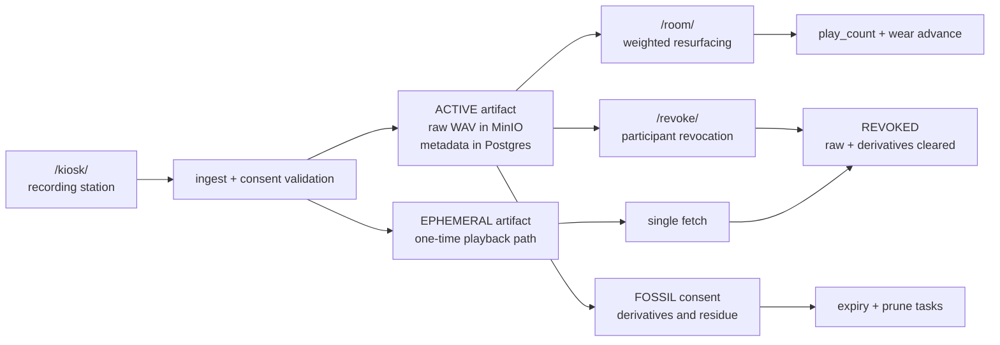

# Memory Engine Manual

Memory Engine is a local-first room memory appliance. One surface records a short offering, one surface lets the room listen back over time, and one surface lets a steward keep the machine healthy without turning it into a heavy moderation console.

This documentation set is the machine's front door. Use it when you need to install, run, repair, or extend the stack without reverse-engineering intent from the repo layout.

{ .hero-shot }

## The Machine In One Diagram

The key point is that Memory Engine is not only a recorder. It is a machine for truthful intake, bounded afterlife, and legible stewardship.

## What This Machine Is

- a dedicated recording surface at `/kiosk/`
- a dedicated listening surface at `/room/`
- a steward surface at `/ops/`
- a participant-facing revoke flow at `/revoke/`
- a local-first runtime built around Django, Postgres, Redis, Celery, and MinIO

Memory Engine remains the canonical center of the project. The deployment family exists so the same appliance can support closely related public rituals without turning into a generic platform.

## What The Manual Adds Beyond The Repo Front Page

- a role-based entry path instead of one long README
- machine diagrams for ingest, playback, wear, expiry, and revocation
- an explicit proof board for what this stack has already demonstrated and what still needs experimental validation
- a clearer split between install-day guidance, steward rituals, architecture, and project direction

## Site Branches

Use the manual by branch, not by filename.

| Branch | What it is for | Start here |
|---|---|---|
| Start Here | install-day orientation, lifecycle overview, and practical operating entry points | [start-here-branch.md](./start-here-branch.md) |
| Machine | architecture, browser/API boundaries, deployment behavior, and control seams | [machine-branch.md](./machine-branch.md) |
| Steward & Participant Materials | the light public/steward handoff layer around the machine | [stewardship-branch.md](./stewardship-branch.md) |
| Teaching & Evaluation | instructor-ready modules, labs, templates, and bounded research-evaluation scaffolds | [teaching/index.md](./teaching/index.md) |
| Project Direction | mission boundary, open work, and strategic posture | [project-direction-branch.md](./project-direction-branch.md) |

## Start With The Right Path

If you are installing the machine:

- start with [start-here.md](./start-here.md)
- then use [installation-checklist.md](./installation-checklist.md)
- use [UBUNTU_APPLIANCE.md](./UBUNTU_APPLIANCE.md) for the current host recipe

If you are stewarding a live node:

- use [OPERATOR_DRILL_CARD.md](./OPERATOR_DRILL_CARD.md) for the shortest recovery ritual
- use [maintenance.md](./maintenance.md) for the full runbook
- use [PRESENCE_SENSING.md](./PRESENCE_SENSING.md) before enabling camera-adjacent presence sensing
- use [participant-prompt-card.md](./participant-prompt-card.md) for the public handoff language

If you are changing code or deployment behavior:

- use [AT_A_GLANCE.md](./AT_A_GLANCE.md) for subsystem ownership and first knobs
- use [repo-coverage-map.md](./repo-coverage-map.md) for full repo path-to-doc coverage
- use [memory-lifecycle.md](./memory-lifecycle.md) for the actual artifact path through the current stack
- use [how-the-stack-works.md](./how-the-stack-works.md) for architecture
- use [surface-contract.md](./surface-contract.md) for browser/API boundaries
- use [DEPLOYMENT_BEHAVIORS.md](./DEPLOYMENT_BEHAVIORS.md) for deployment-specific grammar

If you are deciding what still needs to be proven:

- use [experimental-proofs.md](./experimental-proofs.md)
- then cross-check [roadmap.md](./roadmap.md)

If you are teaching, training stewards, or running bounded evaluations:

- start with [teaching/index.md](./teaching/index.md)
- then use [teaching/instructor-guide.md](./teaching/instructor-guide.md) and [teaching/learning-objectives.md](./teaching/learning-objectives.md)

## Surface Map

| Surface | Purpose | Open This First |
|---|---|---|
| `/kiosk/` | Record an offering, review it, choose consent, receive a revoke code | [installation-checklist.md](./installation-checklist.md) |
| `/room/` | Play the room loop on a dedicated listening machine | [multi-machine-setup.md](./multi-machine-setup.md) |
| `/ops/` | Check health, pause intake/playback, steward artifacts, run local monitor checks | [maintenance.md](./maintenance.md) |
| `/revoke/` | Public revocation flow using the participant receipt code | [participant-prompt-card.md](./participant-prompt-card.md) |

## Current Reference Posture

- target host image: `Ubuntu Server 24.04.4 LTS`
- canonical runtime: `docker compose up --build`
- canonical repo gate: `./scripts/check.sh`
- default deployment: `ENGINE_DEPLOYMENT=memory`
- recommended install split: one kiosk machine, one room machine, one steward machine

## Read These Next

| If you need to understand... | Go here |
|---|---|
| where every top-level repo path fits and which doc owns it | [repo-coverage-map.md](./repo-coverage-map.md) |
| the lifecycle of a memory as currently implemented | [memory-lifecycle.md](./memory-lifecycle.md) |
| what the machine still needs experimental proof for | [experimental-proofs.md](./experimental-proofs.md) |
| the main code ownership map | [AT_A_GLANCE.md](./AT_A_GLANCE.md) |
| the full architecture and process split | [how-the-stack-works.md](./how-the-stack-works.md) |
| deployment-specific behavior differences | [DEPLOYMENT_BEHAVIORS.md](./DEPLOYMENT_BEHAVIORS.md) |

## Documentation Map

- [start-here-branch.md](./start-here-branch.md): navigation hub for install and orientation docs
- [start-here.md](./start-here.md): role-based orientation
- [AT_A_GLANCE.md](./AT_A_GLANCE.md): shortest machine map
- [repo-coverage-map.md](./repo-coverage-map.md): end-to-end repo path map and ownership links
- [memory-lifecycle.md](./memory-lifecycle.md): ingest, playback, wear, expiry, and revoke diagrams
- [experimental-proofs.md](./experimental-proofs.md): proof board for current and next validation passes
- [maintenance.md](./maintenance.md): deploy, backup, restore, and repair commands
- [PRESENCE_SENSING.md](./PRESENCE_SENSING.md): ethics/install boundary for optional audience-presence sensing
- [UBUNTU_APPLIANCE.md](./UBUNTU_APPLIANCE.md): firewall and restart-on-boot host recipe
- [machine-branch.md](./machine-branch.md): navigation hub for architecture and behavior docs
- [how-the-stack-works.md](./how-the-stack-works.md): architecture and request flow
- [stewardship-branch.md](./stewardship-branch.md): navigation hub for steward and participant handoff material
- [teaching/index.md](./teaching/index.md): navigation hub for teaching modules, labs, prompts, rubric, and evaluation templates
- [project-direction-branch.md](./project-direction-branch.md): navigation hub for mission and roadmap docs
- [MISSION_EXPANSION.md](./MISSION_EXPANSION.md): strategic boundary for the project
- [roadmap.md](./roadmap.md): what is still open and why
