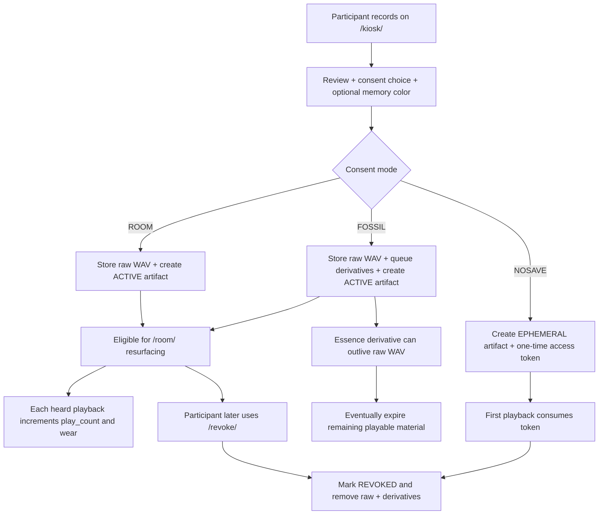
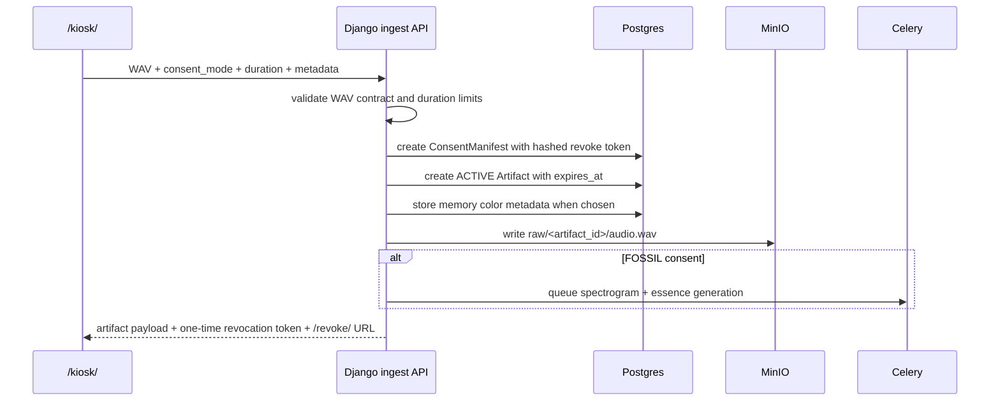
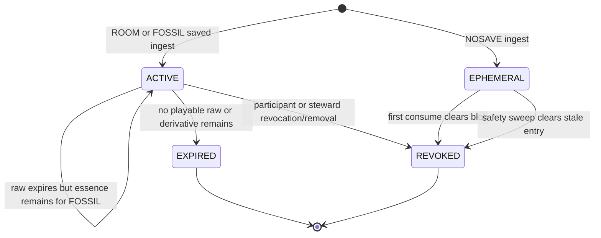
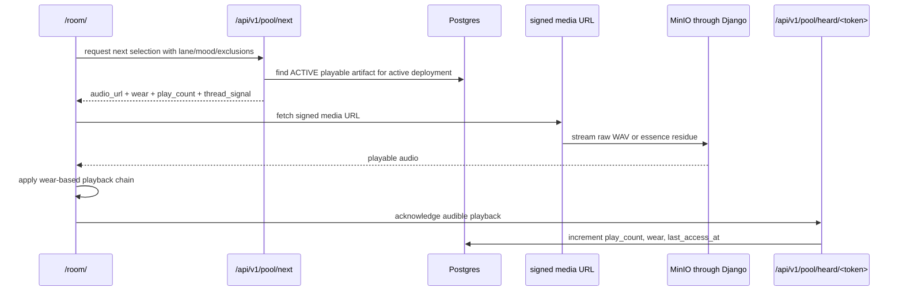
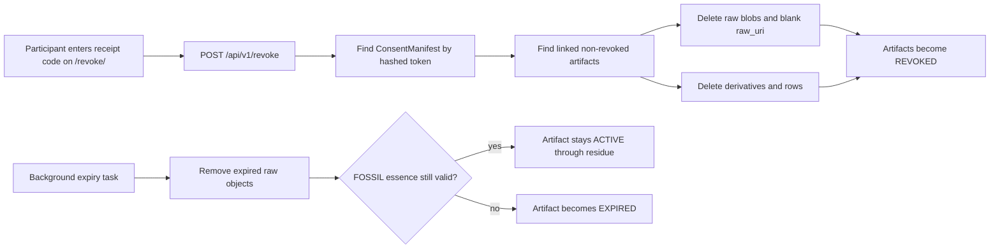

# Memory Lifecycle

This page is the shortest machine-specific explanation of what happens to a memory after someone records it on the kiosk.

Use it when you want the lifecycle model without reading the full architecture walkthrough in [how-the-stack-works.md](./how-the-stack-works.md).

## Current Lifecycle At A Glance

## Saved Ingest Path

The normal saved path uses `POST /api/v1/artifacts/audio`.

What matters about this path:

- the revocation token is only returned once
- the raw WAV stays dry in storage even when a participant chooses a memory color
- memory color is metadata and playback shaping, not a second stored render
- `FOSSIL` adds an explicit afterlife path instead of making raw storage permanent

## State Model

The machine uses a small explicit state model rather than a large archive workflow.

The practical consequence is that the stack treats revocation, expiry, and ephemeral disposal as first-class lifecycle events, not afterthoughts.

## Playback And Wear

The room loop is browser-composed but server-governed.

What matters here:

- the server decides eligibility
- the browser shapes the audible patina
- wear changes playback texture, not the stored object
- `question` and `repair` can also carry short `thread_signal` hints through this path

## Revocation And Expiry

Two different endings matter in the current stack:

- `REVOKED`: an explicit participant or steward removal
- `EXPIRED`: the retention window ended and no playable material remains

## Current Design Boundaries

- one machine, one lifecycle grammar, several deployment temperaments
- small artifact states instead of a moderation workflow tree
- lightweight metadata instead of transcripts or embeddings
- bounded browser DSP instead of arbitrary effect graphs
- public revocation stays local to the node that issued the receipt

If you need the code ownership behind this lifecycle, use [AT_A_GLANCE.md](./AT_A_GLANCE.md). If you need the full architectural explanation, use [how-the-stack-works.md](./how-the-stack-works.md).
