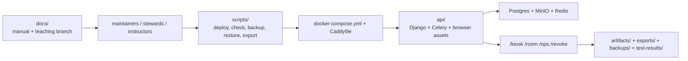

# Repo Coverage Map

Use this page when you need a full-repo map without guessing which path is source, generated output, runtime state, or operational evidence.

If you only need runtime ownership and first knobs, use [AT_A_GLANCE.md](./AT_A_GLANCE.md).
If you only need architecture and lifecycle behavior, use [how-the-stack-works.md](./how-the-stack-works.md) and [memory-lifecycle.md](./memory-lifecycle.md).

## End-To-End Shape

## Top-Level Paths

| Path | What lives here | Read this first |
|---|---|---|
| `README.md` | Repo front page, runtime contract, fast start, deployment notes | [index.md](./index.md) |
| `docs/` | Canonical manual, branch navigation, teaching/evaluation branch | [index.md](./index.md) |
| `api/` | Django project, API endpoints, templates, static JS/CSS, models, Celery tasks | [AT_A_GLANCE.md](./AT_A_GLANCE.md) |
| `scripts/` | Operational command lane (`check`, `deploy`, `doctor`, `backup`, `restore`, `export`) | [maintenance.md](./maintenance.md) |
| `browser-tests/` | Playwright end-to-end surface tests and smoke tests | [maintenance.md](./maintenance.md) |
| `frontend-tests/` | Browser-surface unit tests for kiosk/room/ops JS modules | [AT_A_GLANCE.md](./AT_A_GLANCE.md) |
| `.github/workflows/` | CI gate (`check.yml`) mirroring local repo check lane | [maintenance.md](./maintenance.md) |
| `presence_sensor/` | Optional OpenCV audience-presence sidecar service | [maintenance.md](./maintenance.md) |
| `firmware/` | Optional Leonardo kiosk trigger firmware | [HANDS_FREE_CONTROLS.md](./HANDS_FREE_CONTROLS.md) |
| `artifacts/` | Documentation/support image assets and screenshots | [index.md](./index.md) |
| `backups/` | Local backup outputs from `scripts/backup.sh` | [maintenance.md](./maintenance.md) |
| `exports/` | Fossil/stat export bundles from `scripts/export_bundle.sh` | [ARCHIVE_STEWARDSHIP.md](./ARCHIVE_STEWARDSHIP.md) |
| `docker-compose.yml` | Main runtime composition and service wiring | [how-the-stack-works.md](./how-the-stack-works.md) |
| `docker-compose.release-smoke.yml` | Disposable release smoke overlay | [maintenance.md](./maintenance.md) |
| `Caddyfile` | Reverse-proxy public entry path to API container | [how-the-stack-works.md](./how-the-stack-works.md) |
| `.env.example` | Canonical env contract template | [installation-checklist.md](./installation-checklist.md) |
| `mkdocs.yml` | Docs build/nav structure and Mermaid plugin config | [index.md](./index.md) |

## API Subtree Coverage

| Path | Purpose | Read this first |
|---|---|---|
| `api/memory_engine/` | Settings, deployment/profile catalogs, config validation, URL root, Celery bootstrap | [AT_A_GLANCE.md](./AT_A_GLANCE.md) |
| `api/engine/api_views.py` | Main surface/API endpoints and surface-state payloads | [surface-contract.md](./surface-contract.md) |
| `api/engine/pool.py` | Playback artifact selection and anti-repetition behavior | [DEPLOYMENT_BEHAVIORS.md](./DEPLOYMENT_BEHAVIORS.md) |
| `api/engine/deployment_policy.py` | Deployment-specific weighting and framing behavior | [DEPLOYMENT_BEHAVIORS.md](./DEPLOYMENT_BEHAVIORS.md) |
| `api/engine/tasks.py` | Derivative generation, expiry, and background maintenance jobs | [maintenance.md](./maintenance.md) |
| `api/engine/ops.py` | Health aggregation and operator diagnostics backing `/ops/` | [maintenance.md](./maintenance.md) |
| `api/engine/steward.py` | Steward controls, stack actions, and audit logging paths | [ARCHIVE_STEWARDSHIP.md](./ARCHIVE_STEWARDSHIP.md) |
| `api/engine/operator_auth.py` | `/ops/` shared-secret session, lockout, and session-binding posture | [maintenance.md](./maintenance.md) |
| `api/engine/models.py` | Artifact, derivative, steward state, and operator audit models | [memory-lifecycle.md](./memory-lifecycle.md) |
| `api/engine/static/engine/` | Kiosk/room/ops/revoke browser logic and styling | [surface-contract.md](./surface-contract.md) |
| `api/engine/templates/engine/` | HTML surface shells for kiosk, room, ops, and revoke | [surface-contract.md](./surface-contract.md) |
| `api/engine/tests/` | Python tests for pool, ops, artifacts, config, and scheduling | [maintenance.md](./maintenance.md) |
| `api/engine/management/commands/` | Operator and diagnostics management commands | [maintenance.md](./maintenance.md) |

## Script Coverage

| Script | Scope | Read this first |
|---|---|---|
| `scripts/check.sh` | Canonical repo gate (Python tests, frontend tests, browser checks, coverage) | [maintenance.md](./maintenance.md) |
| `scripts/deploy.sh` | Public-host deploy, env wiring, compose rollout | [maintenance.md](./maintenance.md) |
| `scripts/update.sh` | Pull/check/doctor/backup/deploy/status wrapper | [maintenance.md](./maintenance.md) |
| `scripts/doctor.sh` | Deployment sanity checks and warning posture checks | [maintenance.md](./maintenance.md) |
| `scripts/backup.sh` | Full local backup outputs (DB + object storage + manifest) | [maintenance.md](./maintenance.md) |
| `scripts/restore.sh` | Destructive restore flow with pre-restore snapshot | [maintenance.md](./maintenance.md) |
| `scripts/export_bundle.sh` | Fossil + anonymized-stat export bundle creation | [ARCHIVE_STEWARDSHIP.md](./ARCHIVE_STEWARDSHIP.md) |
| `scripts/release_smoke.sh` | Disposable release smoke stack validation | [maintenance.md](./maintenance.md) |
| `scripts/research_smoke.sh` | Research/evaluation smoke ritual | [experimental-proofs.md](./experimental-proofs.md) |
| `scripts/support_bundle.sh` | Support evidence bundle capture for diagnostics | [maintenance.md](./maintenance.md) |
| `scripts/browser_kiosk.sh` | Dedicated kiosk/room browser launch wrapper | [multi-machine-setup.md](./multi-machine-setup.md) |
| `scripts/first_boot.sh` | First-host bootstrap + optional deploy | [UBUNTU_APPLIANCE.md](./UBUNTU_APPLIANCE.md) |
| `scripts/ubuntu_appliance.sh` | Host-level appliance policy setup helper | [UBUNTU_APPLIANCE.md](./UBUNTU_APPLIANCE.md) |

## Build And Generated Paths

These paths are expected in local worktrees but are not canonical source of truth:

- `.venv/`: local virtualenv convenience lane
- `node_modules/`: Node dependency install output
- `site/`: built MkDocs output
- `test-results/`: local test artifacts and coverage reports
- `backups/` and `exports/`: operational outputs created by runbooks
- `api/db.sqlite3`: local scratch DB for non-compose convenience runs

## If You Need To Change X, Start Here

| Change goal | First code path | First manual page |
|---|---|---|
| Intake copy, consent flow, kiosk behavior | `api/engine/static/engine/kiosk*.js`, `api/engine/templates/engine/kiosk.html` | [surface-contract.md](./surface-contract.md) |
| Room temperament, playback pacing, anti-repetition | `api/engine/pool.py`, `api/engine/deployment_policy.py`, `api/engine/static/engine/kiosk-room-loop*.js` | [DEPLOYMENT_BEHAVIORS.md](./DEPLOYMENT_BEHAVIORS.md) |
| Operator warnings and controls | `api/engine/ops.py`, `api/engine/steward.py`, `api/engine/static/engine/operator-dashboard.js` | [maintenance.md](./maintenance.md) |
| Retention, expiry, derivative lifecycle | `api/engine/tasks.py`, `api/engine/models.py`, `api/engine/storage.py` | [memory-lifecycle.md](./memory-lifecycle.md) |
| Deploy and host posture | `scripts/deploy.sh`, `scripts/first_boot.sh`, `docker-compose.yml`, `Caddyfile` | [UBUNTU_APPLIANCE.md](./UBUNTU_APPLIANCE.md) |
| Teaching, labs, and evaluation templates | `docs/teaching/` | [teaching/index.md](./teaching/index.md) |
