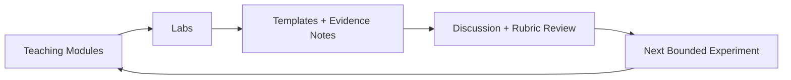

# Teaching & Evaluation Branch

This branch treats Memory Engine as a teachable system and an evaluable public installation.

Use it when you are:
- teaching local-first civic/arts technology
- running a studio or seminar around participatory memory systems
- rehearsing steward operations as a research method
- evaluating deployment behavior without widening the project into a platform

Memory Engine stays the canonical center. `Room Memory` remains participant-facing language.

## Teaching Flow At A Glance

## Start Paths

| If you are... | Start here | Then go to |
|---|---|---|
| instructor or facilitator | [instructor-guide.md](./instructor-guide.md) | [learning-objectives.md](./learning-objectives.md) |
| student or trainee steward | [learning-objectives.md](./learning-objectives.md) | [modules/room-memory-as-a-system.md](./modules/room-memory-as-a-system.md) |
| researcher planning a pilot | [modules/experimental-deployment-evaluation.md](./modules/experimental-deployment-evaluation.md) | [templates/pilot-notes-template.md](./templates/pilot-notes-template.md) |
| team running practical drills | [labs/ops-recovery-drill.md](./labs/ops-recovery-drill.md) | [templates/restore-drill-template.md](./templates/restore-drill-template.md) |

## Branch Map

### Core framing
- [instructor-guide.md](./instructor-guide.md)
- [learning-objectives.md](./learning-objectives.md)
- [assessment-rubric.md](./assessment-rubric.md)

### Teaching modules
- [room-memory-as-a-system.md](./modules/room-memory-as-a-system.md)
- [local-first-architecture.md](./modules/local-first-architecture.md)
- [consent-retention-revocation.md](./modules/consent-retention-revocation.md)
- [browser-surfaces-public-interfaces.md](./modules/browser-surfaces-public-interfaces.md)
- [playback-wear-composition.md](./modules/playback-wear-composition.md)
- [ops-stewardship-recovery.md](./modules/ops-stewardship-recovery.md)
- [experimental-deployment-evaluation.md](./modules/experimental-deployment-evaluation.md)
- [ethics-public-memory-boundaries.md](./modules/ethics-public-memory-boundaries.md)

### Lab guides
- [trace-memory-through-stack.md](./labs/trace-memory-through-stack.md)
- [consent-revocation-audit.md](./labs/consent-revocation-audit.md)
- [observe-room-playback-behavior.md](./labs/observe-room-playback-behavior.md)
- [ops-recovery-drill.md](./labs/ops-recovery-drill.md)
- [compare-deployment-temperaments.md](./labs/compare-deployment-temperaments.md)
- [participant-comprehension-check.md](./labs/participant-comprehension-check.md)

### Shared language and prompts
- [glossary.md](./glossary.md)
- [discussion-prompts.md](./discussion-prompts.md)

### Evaluation templates
- [pilot-notes-template.md](./templates/pilot-notes-template.md)
- [steward-handoff-template.md](./templates/steward-handoff-template.md)
- [install-rehearsal-template.md](./templates/install-rehearsal-template.md)
- [restore-drill-template.md](./templates/restore-drill-template.md)
- [participant-comprehension-template.md](./templates/participant-comprehension-template.md)

## What This Branch Reuses

This branch intentionally links to existing machine truth instead of copying it:
- lifecycle truth: [memory-lifecycle.md](../memory-lifecycle.md)
- architecture and boundaries: [how-the-stack-works.md](../how-the-stack-works.md), [surface-contract.md](../surface-contract.md)
- stewardship operations: [maintenance.md](../maintenance.md), [OPERATOR_DRILL_CARD.md](../OPERATOR_DRILL_CARD.md)
- behavior differences: [DEPLOYMENT_BEHAVIORS.md](../DEPLOYMENT_BEHAVIORS.md)
- proof posture: [experimental-proofs.md](../experimental-proofs.md), [roadmap.md](../roadmap.md)

## Boundary

Teaching and evaluation here are bounded:
- no transcripts or semantic inference layer
- no participant surveillance posture
- no platformization move
- no replacement of steward judgment with opaque scoring
