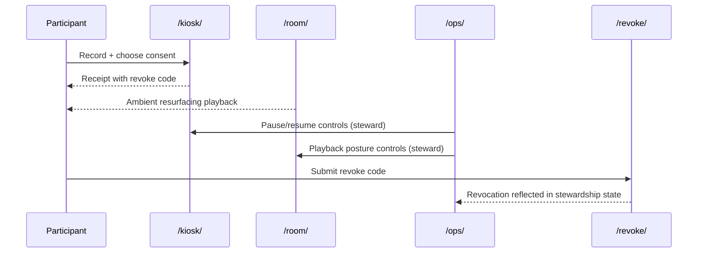

# Module: Browser Surfaces And Public Interfaces

## Purpose

Explain how the four browser surfaces form a social and technical contract.

## Multi-Surface Interaction Flow

## Anchor Reading

- [surface-contract.md](../../surface-contract.md)
- [multi-machine-setup.md](../../multi-machine-setup.md)
- [FIRST_DAY_PACKET.md](../../FIRST_DAY_PACKET.md)

## Key Ideas

- `/kiosk/` captures offerings.
- `/room/` performs memory.
- `/ops/` tends the machine.
- `/revoke/` preserves participant agency.
- Clear surface separation reduces role confusion and protects stewardship boundaries.
- Public interface quality includes pacing, language, and recovery behavior.

## In-Class Flow (30-45 min)

1. Assign roles (participant, steward, maintainer).
2. Simulate one complete pass across surfaces.
3. Document where role confusion appears and why.

## Reflection Prompts

- What should never appear on `/kiosk/`?
- Which operator details should remain steward-only?
