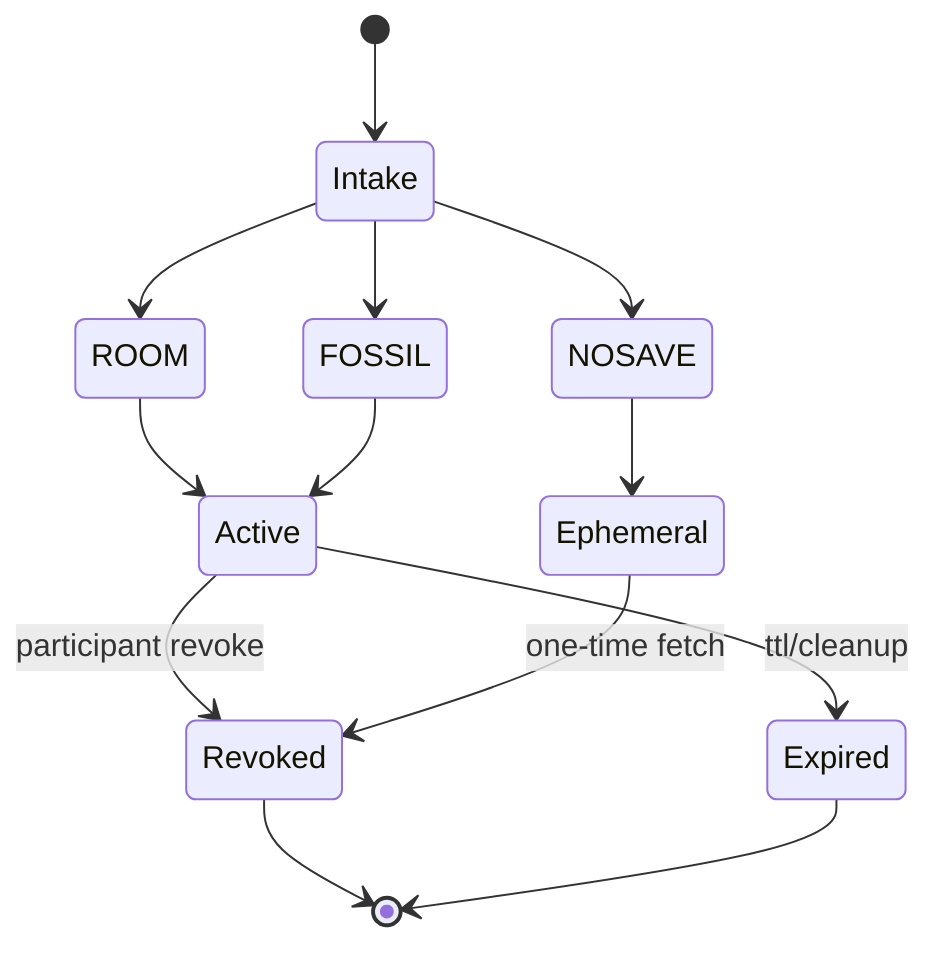

# Module: Consent, Retention, And Revocation

## Purpose

Teach consent modes as storage/afterlife policy, not only UI choices.

## Consent And Retention Flow

## Anchor Reading

- [memory-lifecycle.md](../../memory-lifecycle.md)
- [participant-prompt-card.md](../../participant-prompt-card.md)
- [ARCHIVE_STEWARDSHIP.md](../../ARCHIVE_STEWARDSHIP.md)

## Key Ideas

- `ROOM`, `FOSSIL`, and `NOSAVE` are materially different retention paths.
- Revocation is participant-facing and should remain legible without steward mediation.
- Retention posture should be explained in plain language, not hidden in policy jargon.

## In-Class Flow (35-50 min)

1. Compare consent modes by what persists and for how long.
2. Trace a revoke code through `/revoke/` to artifact status changes.
3. Review where misunderstanding could produce false participant expectations.

## Reflection Prompts

- Which words in current prompt language could overpromise?
- How should a steward explain uncertainty honestly?
