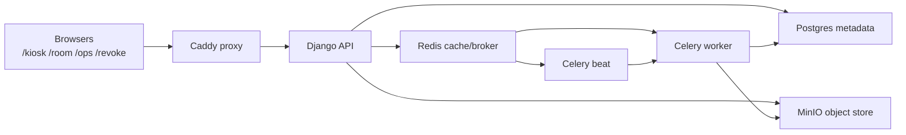

# Module: Local-First Architecture

## Purpose

Explain why Memory Engine is intentionally local-first and how that shapes deployment, operations, and risk.

## Architecture Flow

## Anchor Reading

- [how-the-stack-works.md](../../how-the-stack-works.md)
- [surface-contract.md](../../surface-contract.md)
- [UBUNTU_APPLIANCE.md](../../UBUNTU_APPLIANCE.md)

## Key Ideas

- Local-first is an operational and ethical decision, not only a topology detail.
- Browser, API, queue, database, and object storage each keep a clear seam.
- Reproducibility depends on explicit scripts and bounded runtime contracts.

## In-Class Flow (35-50 min)

1. Draw the process map (`proxy`, `api`, `worker`, `beat`, `db`, `redis`, `minio`).
2. For each process, identify one likely failure and one detection path.
3. Discuss what changes if services move off-node.

## Reflection Prompts

- Which local assumptions are load-bearing for trust?
- Which defaults are acceptable for class use but unsafe for public deployment?
