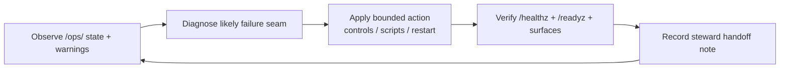

# Module: Ops, Stewardship, And Recovery

## Purpose

Position steward operations as part of the artwork's integrity, not only administration.

## Steward Recovery Loop

## Anchor Reading

- [maintenance.md](../../maintenance.md)
- [OPERATOR_DRILL_CARD.md](../../OPERATOR_DRILL_CARD.md)
- [HANDOFF_REHEARSAL.md](../../HANDOFF_REHEARSAL.md)

## Key Ideas

- Soft failures (stale workers, queue drift, storage pressure) matter as much as hard crashes.
- Drills build trust faster than ad hoc heroics.
- Steward actions require auditable, explainable pathways.

## In-Class Flow (40-60 min)

1. Read current node status and warnings.
2. Run one controlled degradation + recovery scenario.
3. Produce a short steward handoff note.

## Reflection Prompts

- Which warning cards are most likely to be ignored under pressure?
- What evidence proves a handoff is real, not assumed?
