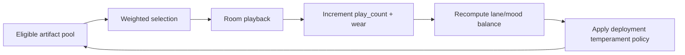

# Module: Playback, Wear, And Composition

## Purpose

Teach room playback as a compositional system with operational constraints.

## Playback Composition Loop

## Anchor Reading

- [DEPLOYMENT_BEHAVIORS.md](../../DEPLOYMENT_BEHAVIORS.md)
- [RESPONSIVENESS.md](../../RESPONSIVENESS.md)
- [memory-lifecycle.md](../../memory-lifecycle.md)

## Key Ideas

- Playback is weighted resurfacing, not random shuffle.
- Wear and play count shape recurrence and texture over time.
- Deployment temperament changes room feel while keeping one machine contract.

## In-Class Flow (35-50 min)

1. Observe lane/mood summaries in `/ops/`.
2. Compare playback behavior before and after additional ingest.
3. Discuss how policy tuning affects perceived memory texture.

## Reflection Prompts

- When does recurrence feel meaningful versus repetitive?
- Which tuning knobs are artistic, and which are reliability knobs?
