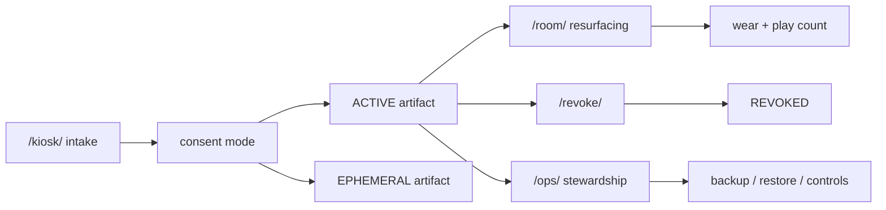

# Module: Room Memory As A System

## Purpose

Introduce Memory Engine as a coherent system where intake, resurfacing, stewardship, and revocation are one machine, not separate apps.

## System Flow

## Anchor Reading

- [memory-lifecycle.md](../../memory-lifecycle.md)
- [AT_A_GLANCE.md](../../AT_A_GLANCE.md)

## Key Ideas

- Room Memory is participant-facing language for a bounded machine.
- The machine has four public/steward surfaces with distinct roles.
- System trust depends on lifecycle legibility, not only uptime.

## In-Class Flow (30-45 min)

1. Walk the lifecycle diagram together.
2. Ask learners to map each state to one real surface action.
3. Identify where failures can remain invisible to participants.

## Reflection Prompts

- Which state transitions are participant-visible?
- Which transitions are steward-only but ethically important?
- What would make this feel like a platform instead of an appliance?
